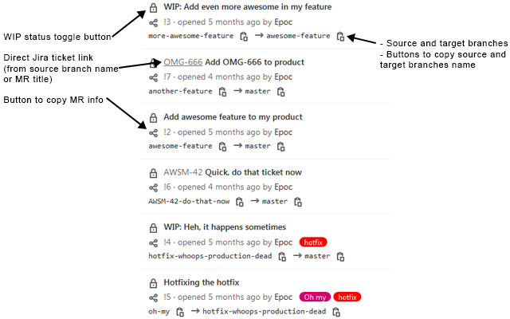

# GitLab Merge Requests lists enhancer

A browser extension that enhance all Merge Requests lists on any instance of Gitlab and GitLab.com.

 

  

## Features

  - No configuration needed: install and it just works
  - Display source and target branches
    - Can be enabled/disabled in the extension preferences
    - Buttons allowing to easily copy these branches name (can be enabled/disabled in the extension preferences)
  - Button allowing to copy Merge Request information (useful when sharing the Merge Request on e.g instant messaging softwares)
    - Can be enabled/disabled in the extension preferences
    - Text format is customizable (with support of placeholders)
  - Direct Jira ticket link
    - Can be enabled/disabled in the extension preferences
    - Ticket ID is automatically detected in source branch name or Merge Request title
    - Base Jira URL is configured in extension preferences
    - The ticket ID or an icon can be displayed as the link label (configured in extension preferences)
  - WIP toggle button (can be enabled/disabled in the extension preferences)
  - Show an indicator when there's unresolved discussions left on Merge Requests
    - Can be enabled/disabled in the extension preferences
    - Note the **All discussions must be resolved** option must be enabled for this feature to be working as expected. This option must be enabled per project and is located in **Settings > General > Merge Requests > Merge checks**
  - Compatible with all GitLab editions (GitLab CE, GitLab EE, GitLab.com) (look at the prerequisites, though)

## Prerequisites

  - **GitLab**: the latest available version of GitLab or GitLab.com
  - **Firefox**: >= 63 (because this extension uses the `clipboard.writeText` API)
  - **Chrome**: >= 66 (because this extension uses the `clipboard.writeText` API)

## Installation

  - **Firefox**: from the [Firefox Add-ons](https://addons.mozilla.org/en-US/firefox/addon/gitlab-mrs-lists-enhancer/) website
  - **Chrome**: from the [Chrome Web Store](https://chrome.google.com/webstore/detail/gitlab-merge-requests-lis/emiefdjcbfjkaofipmdcflcddcchmdkf) website

You can also install this add-on manually by using one of the ZIP files on the [Releases](https://github.com/EpocDotFr/gitlab-merge-requests-lists-enhancer/releases) page.

## Credits

  - Logo: [GitLab](https://about.gitlab.com/press/press-kit/#logos) and [Octicons](https://primer.style/octicons/git-pull-request) (MIT License)

## FAQ

  - Why is there still clickable links on deleted source/target branches name?

Due to a technical GitLab limitation, the extension has no reliable way to determine if a branch has been deleted. Therefore, branches name are always links and are always clickable even though it's leading to a 404 page.

  - Can you display a link to the Merge Request linked to the target branch, if any?

It would be great, however the extension has no reliable way to do that due to a technical GitLab limitation.

  - Pipeline status icons aren't being automatically updated on Merge Requests lists (it is on other pages), can you add this feature?

That was the initial idea for the 1.6 release, however it's not possible due to a technical GitLab limitation.

  - Some feature looks broken on GitLab version [old version of GitLab]. Can you please fix that?

Nope. I don't want to deal with old versions of GitLab. Too much work.

## Changelog

See [here](https://github.com/EpocDotFr/gitlab-merge-requests-lists-enhancer/releases).

## License

[DBAD 1.1](LICENSE.md)

## End words

If you have questions or problems, you can [submit an issue](https://github.com/EpocDotFr/gitlab-merge-requests-lists-enhancer/issues).

You can also submit pull requests. It's open-source dude!
