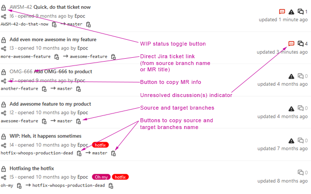

# GitLab Merge Requests lists enhancer

A browser extension that enhance all Merge Requests lists on any instance of Gitlab and GitLab.com.

  

## Features

  - Display source and target branches
    - Buttons allowing to easily copy these branches name (can be disabled in the extension preferences)
  - Compatible with all GitLab editions (GitLab CE, GitLab EE, GitLab.com) (look at the prerequisites, though)
  - No configuration needed

## Prerequisites

  - **GitLab**: 9.0 or above or GitLab.com (this addon requires GitLab API v4)
  - **Firefox**: >= 63 (because this extension uses the clipboard API)
  - **Chrome**: >= 66 (because this extension uses the clipboard API)

## Installation

  - **Firefox**: from the [Firefox Add-ons](https://addons.mozilla.org/en-US/firefox/addon/gitlab-mrs-lists-enhancer/) website
  - **Chrome**: from the [Chrome Web Store](https://chrome.google.com/webstore/detail/gitlab-merge-requests-lis/emiefdjcbfjkaofipmdcflcddcchmdkf) website

## Credits

  - Logo by [Thanga Vignesh P](https://www.iconfinder.com/icons/5402348/add_list_playlist_icon) (CC BY-NC 3.0)

## Roadmap

👉 = current version

  - **1.0** - Initial release (display Merge Request source and target branches)
  - 👉 **1.1** - Copy source and target branches name
  - **1.2** - Copy basic Merge Request information (intended for sharing on e.g instant messaging softwares)
  - **1.3** - Direct Jira ticket link (automatic detection of ticket ID in branch name or Merge Request title)
  - **1.4** - WIP / unWIP toggle button

## License

[DBAD 1.1](LICENSE.md)

## End words

If you have questions or problems, you can [submit an issue](https://github.com/EpocDotFr/gitlab-merge-requests-lists-enhancer/issues).

You can also submit pull requests. It's open-source dude!
